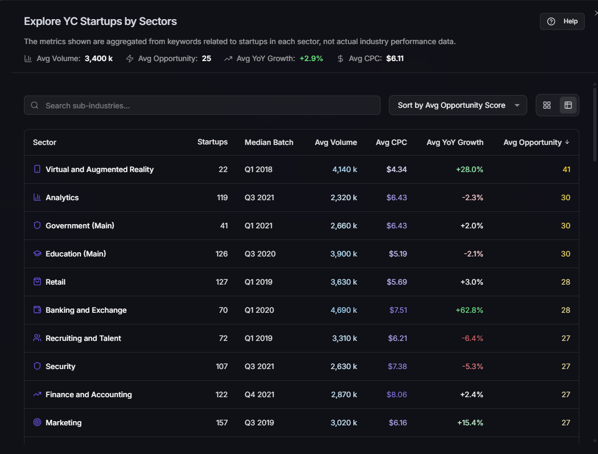
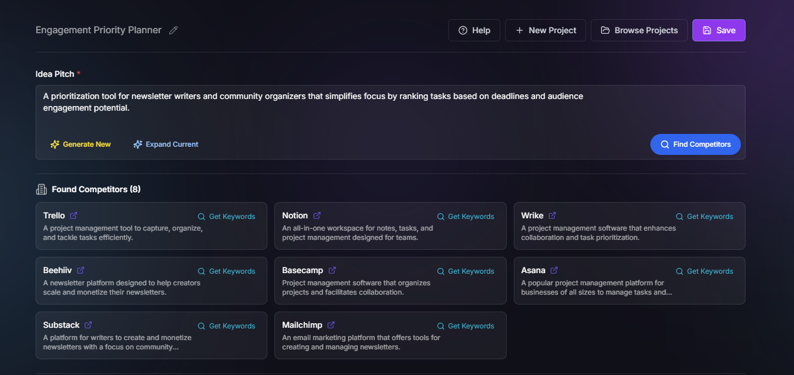
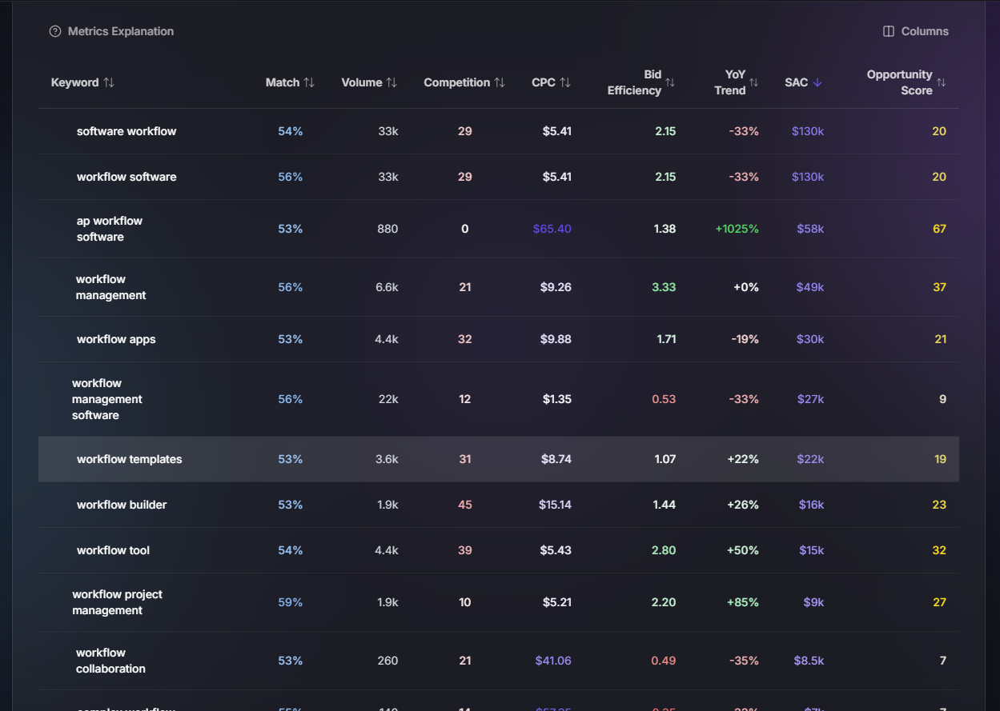
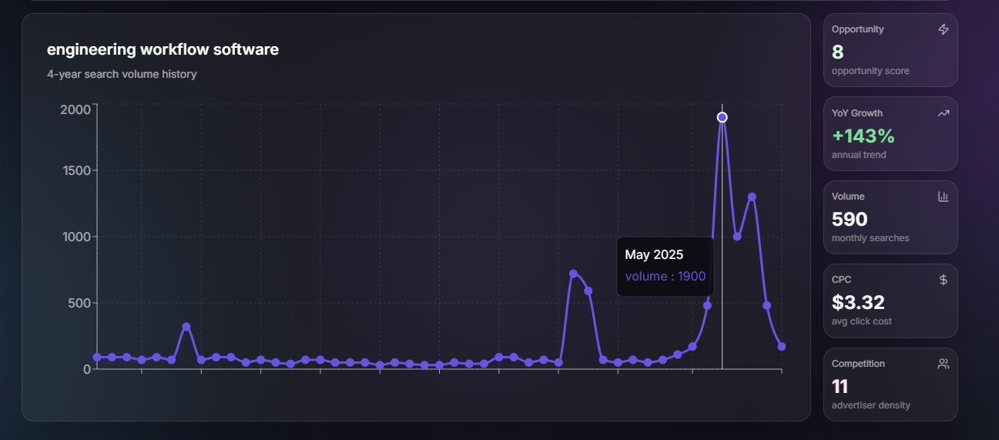

# TrendSearch 🚀

> AI-powered platform to validate startup ideas using real keyword data and market insights

[](https://opensource.org/licenses/MIT)
[](https://www.typescriptlang.org/)
[](https://react.dev/)
[](https://nodejs.org/)

**🌐 [Live Demo](https://trends.pioneerslab.ai/)**

TrendSearch is a platform designed to help entrepreneurs validate startup ideas. It leverages AI-powered generation for microSaaS ideas, provides market research insights using real keyword data, and offers interactive trend visualization to identify high-potential startup opportunities.

## ✨ Features

- 🤖 **AI-Powered Idea Generation** - Generate microSaaS ideas using GPT-4o-mini
- 📊 **Market Validation** - Real keyword data from 80,000+ Google Ads keywords
- 📈 **Trend Analysis** - Interactive 12-month trend visualizations
- 💡 **Opportunity Scoring** - AI-calculated opportunity scores for each keyword
- 🔍 **Semantic Search** - Vector-based keyword matching using sentence transformers
- 💳 **Payment Integration** - Stripe integration for premium features

## 🖼️ Screenshots


*Explore YC startups by sectors with aggregated metrics*


*Interactive 4-year search volume history charts*


*Detailed keyword metrics with opportunity scores*


*AI-powered idea generation and competitor analysis*

**🌐 [View Live Demo](https://trends.pioneerslab.ai/)**

## 🚀 Quick Start

### Prerequisites

- Node.js >= 20.0.0
- npm >= 9.0.0
- PostgreSQL database (via Supabase)

### Installation

1. **Clone the repository**
   ```bash
   git clone https://github.com/ValentinPy1/TrendSearch.git
   cd TrendSearch
   ```

2. **Install dependencies**
   ```bash
   npm install
   ```

3. **Set up environment variables**
   
   Create a `.env` file in the root directory:
   ```env
   # Supabase Configuration
   SUPABASE_URL=your_supabase_url
   SUPABASE_ANON_KEY=your_anon_key
   SUPABASE_SERVICE_ROLE_KEY=your_service_role_key
   DATABASE_URL=your_database_url
   
   # Frontend (Vite)
   VITE_SUPABASE_URL=your_supabase_url
   VITE_SUPABASE_ANON_KEY=your_anon_key
   
   # Optional: Stripe, PostHog, etc.
   ```
   
   See [Environment Setup Guide](docs/ENV_SETUP.md) for detailed instructions.

4. **Run database migrations**
   ```bash
   npm run db:push
   ```

5. **Start development server**
   ```bash
   npm run dev
   ```

6. **Open your browser**
   
   Navigate to `http://localhost:5000`

### Production Build

```bash
npm run build
npm start
```

## 🛠️ Tech Stack

### Frontend
- **React 18.3** - UI framework
- **TypeScript** - Type safety
- **Vite** - Build tool and dev server
- **TailwindCSS** - Styling
- **Shadcn UI** - Component library
- **Recharts** - Data visualization
- **TanStack Query** - Data fetching
- **Wouter** - Routing

### Backend
- **Express.js** - Web framework
- **Node.js** - Runtime
- **TypeScript** - Type safety
- **Drizzle ORM** - Database ORM
- **Passport.js** - Authentication
- **bcryptjs** - Password hashing

### Database & Services
- **Supabase** - PostgreSQL database hosting
- **OpenAI** - AI idea generation (GPT-4o-mini)
- **Stripe** - Payment processing
- **PostHog** - Analytics (optional)
- **DataForSEO** - Keyword metrics (optional)

### Data Processing
- **@xenova/transformers** - Sentence transformers for embeddings
- **Vector Search** - Semantic keyword matching

## 📁 Project Structure

```
TrendSearch/
├── client/              # React frontend application
│   ├── src/
│   │   ├── components/  # React components
│   │   ├── pages/       # Page components
│   │   ├── hooks/       # Custom React hooks
│   │   └── lib/         # Utilities and configurations
│   └── public/          # Static assets
├── server/              # Express backend
│   ├── routes.ts        # API routes
│   ├── keyword-vector-service.ts  # Vector search service
│   └── ...
├── shared/              # Shared TypeScript types and schemas
│   └── schema.ts        # Drizzle ORM schemas
├── scripts/             # Utility scripts
│   ├── database/        # Database migration scripts
│   ├── data/            # Data processing scripts
│   ├── deployment/      # Deployment scripts
│   ├── utils/           # Utility scripts
│   └── metrics/         # Metrics aggregation scripts
├── migrations/          # Database migration files
├── data/                # Static data files
├── docs/                # Documentation
│   ├── images/          # Screenshots
│   └── ...
└── notebooks/           # Jupyter notebooks for analysis
```

For detailed architecture information, see [Architecture Documentation](docs/ARCHITECTURE.md).

## 📚 Documentation

- [Environment Setup](docs/ENV_SETUP.md) - Complete guide to setting up environment variables
- [Architecture Overview](docs/ARCHITECTURE.md) - Project structure and architecture
- [Railway Deployment](docs/RAILWAY_DEPLOYMENT.md) - Deploy to Railway
- [Scripts Documentation](scripts/README.md) - Utility scripts reference
- [MCP Setup](docs/MCP_SETUP.md) - Model Context Protocol setup for Cursor AI

## 🔧 Available Scripts

- `npm run dev` - Start development server
- `npm run build` - Build for production
- `npm start` - Start production server
- `npm run check` - Type check with TypeScript
- `npm run db:push` - Push database schema changes
- `npm run list:projects` - List all projects in database
- `npm run upload:railway` - Upload files to Railway
- `npm run create:minimal-sectors` - Create minimal sectors metrics

See [Scripts Documentation](scripts/README.md) for more details.

## 🎯 Key Features Explained

### AI Idea Generation
Uses GPT-4o-mini to generate concise microSaaS ideas (5-8 words) based on user types and problem natures, guided by microSaaS principles.

### Market Validation
Performs semantic search across 80,157 precomputed keyword embeddings to find relevant keywords for any startup idea.

### Opportunity Scoring
Calculates opportunity scores using the formula: `log(SAC) × Trend Strength × Bid Efficiency`, providing a comprehensive metric for keyword potential.

### Trend Visualization
Interactive charts showing 12-month search volume trends with color-coded gradients for easy interpretation.

## 🤝 Contributing

Contributions are welcome! Please feel free to submit a Pull Request.

1. Fork the repository
2. Create your feature branch (`git checkout -b feature/AmazingFeature`)
3. Commit your changes (`git commit -m 'Add some AmazingFeature'`)
4. Push to the branch (`git push origin feature/AmazingFeature`)
5. Open a Pull Request

## 📄 License

This project is licensed under the MIT License - see the [LICENSE](LICENSE) file for details.

## 👤 Author

**ValentinPy1**

- GitHub: [@ValentinPy1](https://github.com/ValentinPy1)

## 🙏 Acknowledgments

- Built with [Supabase](https://supabase.com) for database hosting
- UI components from [Shadcn UI](https://ui.shadcn.com)
- Icons from [Lucide](https://lucide.dev)
- Data visualization with [Recharts](https://recharts.org)

---

⭐ If you find this project helpful, please consider giving it a star!

